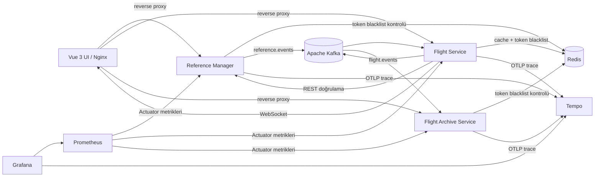

# Flight Management System

> Uçuş operasyonları, referans veriler, gerçek zamanlı durum güncellemeleri ve arşiv yönetimi için geliştirilmiş mikroservis tabanlı full-stack platform.


[](https://github.com/aliozank/Flight-Managment-System/actions/workflows/ci.yml)

## Mimari



Her servis kendi veritabanının sahibidir. Referans sorguları REST, değişiklik bildirimleri Kafka, önbellek ve token iptal kayıtları Redis, canlı UI güncellemeleri ise STOMP/WebSocket üzerinden yürür. UI, Nginx üzerinden servis adlarına reverse proxy yapar; tarayıcı backend portlarını doğrudan bilmez.

## Servisler

| Bileşen | Sorumluluk | Port |
| --- | --- | --- |
| `reference-manager` | Havayolu, havalimanı, uçak, uçak tipi, rota ve uçuş tipi verileri | `8081` |
| `flight-service` | Kimlik doğrulama, kullanıcılar, aktif uçuşlar, durum geçişleri, versiyonlar ve aktivite kayıtları | `8082` |
| `flight_archive_service` | `ARRIVED` ve `CANCELLED` uçuşların idempotent arşivi | `8083` |
| `flight-management-ui` | Operasyon, referans veri, radar, arşiv, kullanıcı ve izleme ekranları | `5173` |

Altyapı portları: Prometheus `9090`, Grafana `3000`, Tempo `3200` (API), OTLP `4317`/`4318`, reference MySQL `3307`, flight MySQL `3308`, archive PostgreSQL `5433`, Redis `6380`, Kafka `9094`.

## Öne çıkan özellikler

- RSA imzalı JWT kimlik doğrulama, rol bazlı yetkilendirme ve Redis tabanlı token revocation
- Uçuş oluşturma, güncelleme, iptal ve CSV ile toplu içe aktarma
- Saat dilimi bilgili kalkış/varış zamanları
- `SCHEDULED`/`DELAYED` uçuşların otomatik `DEPARTED`, ardından `ARRIVED` durumuna geçirilmesi
- Uçak–havayolu uygunluğu, rota ve uçak takvim çakışması doğrulamaları
- Redis referans önbelleği ve Kafka ile cache invalidation
- Uçuş versiyon geçmişi ve aktivite kayıtları
- WebSocket ile canlı ve versiyon kontrollü UI güncellemeleri
- Kafka üzerinden terminal durum arşivleme
- Transactional outbox, atomik event claim, retry, lease recovery ve ShedLock ile güvenilir Kafka yayınlama
- OpenAPI 3 sözleşmeleri ve Swagger UI üzerinden etkileşimli API dokümantasyonu
- OpenTelemetry, Tempo, Prometheus ve Grafana ile dağıtık izleme ve metrik gözlemlenebilirliği
- GitHub Actions ile üç backend test paketi, UI build ve Compose doğrulaması
- Hatalı JSON ve DTO doğrulama istekleri için standart API hata gövdesi
- Docker Compose ve Nginx ile tek komutla full-stack çalışma

## Roller ve ekran erişimi

| Rol | Erişebildiği alanlar |
| --- | --- |
| `ADMIN` | Tüm ekranlar; kullanıcı, referans veri ve uçuş yönetimi |
| `OPERATIONS` | Operasyon paneli, uçuşlar, referans veriler, arşiv ve canlı radar |
| `BI_ANALYST` | Referans veriler ve uçuş arşivi |
| `DEVOPS` | Sistem izleme ve Grafana |

Frontend route korumaları kullanıcı deneyimini düzenler; asıl yetki kontrolü backend servislerindeki Spring Security kurallarıyla uygulanır.

## JWT logout ve token revocation

`flight-service` tarafından üretilen her access token benzersiz bir `jti` taşır. `POST /api/auth/logout` çağrısında bu kimlik, token'ın kalan ömrü kadar TTL ile Redis'e kaydedilir. Üç mikroservisin JWT validator'ı aynı blacklist kaydını kontrol ettiği için logout edilen token tüm servislerde anında `401 Unauthorized` ile reddedilir. Süresi dolan kayıt Redis tarafından otomatik kaldırılır.

## Transactional outbox

`flight-service` ve `reference-manager`, iş verisi ile Kafka event'ini aynı veritabanı transaction'ında `outbox_events` tablosuna yazar. Publisher job kayıtları atomik olarak `PROCESSING` durumuna alır, Kafka ACK sonucuna göre `PUBLISHED` veya `FAILED` durumuna geçirir ve başarısız kayıtları gecikmeli olarak yeniden dener. Süresi dolan claim'ler lease mekanizmasıyla geri alınabilir; ShedLock aynı scheduler'ın birden fazla instance üzerinde eş zamanlı çalışmasını engeller. Yedi günden eski başarılı kayıtlar günlük cleanup job'ıyla silinir.

Kafka producer'ları outbox'ta saklanan JSON metnini `StringSerializer` ile doğrudan gönderir. Consumer tarafındaki `eventId` kontrolleri, teslimatın tekrarlandığı durumlarda idempotent davranışı korur.

## Gereksinimler

- Docker ve Docker Compose
- Yerel UI geliştirmesi için Node.js `^22.18.0` veya `>=24.12.0` ve npm
- Demo veri scripti için `curl` ve `jq`
- Anahtar üretmek için OpenSSL

## İlk kurulum

Repository kökünde `.env` oluşturun:

```dotenv
MYSQL_ROOT_PASSWORD=your_mysql_password
POSTGRES_PASSWORD=your_postgres_password
ADMIN_USERNAME=admin
ADMIN_EMAIL=admin@example.com
ADMIN_PASSWORD=Admin123
```

JWT imzalama anahtarını üretin ve aynı public key'i üç backend servisine yerleştirin:

```bash
mkdir -p local-keys
openssl genpkey -algorithm RSA -out local-keys/private-key.pem -pkeyopt rsa_keygen_bits:2048
openssl rsa -pubout -in local-keys/private-key.pem -out /tmp/flight-management-public-key.pem
cp /tmp/flight-management-public-key.pem flight-service/src/main/resources/keys/public-key.pem
cp /tmp/flight-management-public-key.pem reference-manager/src/main/resources/keys/public-key.pem
cp /tmp/flight-management-public-key.pem flight_archive_service/src/main/resources/keys/public-key.pem
```

Backend servislerini, altyapıyı ve Nginx üzerinde çalışan UI'ı başlatın:

```bash
docker compose config
docker compose up -d --build
docker compose ps
```

İlk açılışta `.env` içindeki bilgilerle bir `ADMIN` hesabı oluşturulur.

Başlıca adresler:

| Bileşen | Adres |
| --- | --- |
| UI | `http://localhost:5173` |
| Grafana | `http://localhost:3000` |
| Prometheus | `http://localhost:9090` |
| Flight Service Swagger | `http://localhost:8082/swagger-ui/index.html` |
| Reference Manager Swagger | `http://localhost:8081/swagger-ui/index.html` |
| Archive Service Swagger | `http://localhost:8083/swagger-ui/index.html` |

Grafana'nın Compose ortamındaki demo giriş bilgileri `admin` / `admin` şeklindedir; gerçek dağıtım öncesinde değiştirilmelidir.

## API dokümantasyonu

Her backend servisi kendi OpenAPI sözleşmesini `/v3/api-docs` altında, etkileşimli arayüzünü `/swagger-ui/index.html` altında sunar. Korumalı endpoint'leri Swagger UI üzerinden denemek için önce `flight-service` login endpoint'inden token alın, sağ üstteki **Authorize** alanına yalnızca token değerini girin ve isteği çalıştırın.

JSON sözleşmeleri doğrudan şu adreslerden alınabilir:

- `http://localhost:8082/v3/api-docs`
- `http://localhost:8081/v3/api-docs`
- `http://localhost:8083/v3/api-docs`

## Demo referans verileri

Servisler sağlıklı duruma geldikten sonra idempotent seed scriptini çalıştırın:

```bash
./scripts/seed-demo-data.sh
```

Script `.env` dosyasındaki admin bilgileriyle giriş yapar; havayolu, havalimanı, uçak tipi, uçak, rota ve uçuş tipi kayıtlarını doğal anahtarlarıyla kontrol eder ve yalnızca eksik olanları ekler. Bu nedenle aynı veri setini çoğaltmadan tekrar çalıştırılabilir.

Farklı adresler kullanılıyorsa:

```bash
FLIGHT_API_URL=http://localhost:8082 REFERENCE_API_URL=http://localhost:8081 ./scripts/seed-demo-data.sh
```

## UI geliştirme modu

Normal kullanımda UI, `docker compose up -d --build` komutuyla Nginx container'ında başlar. Hot reload ile yerel geliştirme yapmak için Docker UI servisini durdurup Vite kullanılabilir:

```bash
docker compose stop flight-management-ui
cd flight-management-ui
npm ci
npm run dev
```

Vite geliştirme proxy'si ve Nginx aynı `/flight-api`, `/reference-api` ve `/archive-api` yollarını kullandığı için frontend kodunda ortam bazlı backend adresi değişikliği gerekmez.

## Build ve test

Her backend servisi kendi dizininde test edilir:

```bash
(cd reference-manager && ./mvnw test)
(cd flight-service && ./mvnw test)
(cd flight_archive_service && ./mvnw test)
```

UI doğrulaması:

```bash
cd flight-management-ui
npm run build
```

Son doğrulanan test durumu:

| Mikroservis | Çalıştırılan | Başarısız | Atlanan | Sonuç |
| --- | ---: | ---: | ---: | --- |
| `reference-manager` | 121 | 0 | 0 | `BUILD SUCCESS` |
| `flight-service` | 168 | 0 | 1 | `BUILD SUCCESS` |
| `flight_archive_service` | 47 | 0 | 0 | `BUILD SUCCESS` |

JWT revocation ayrıca canlı Docker ortamında doğrudan servis portları ve UI Nginx proxy yolları üzerinden doğrulanmıştır: logout öncesinde `200`, logout edilen eski token ile üç serviste `401`, yeni token ile tekrar `200` alınmıştır.

## Gözlemlenebilirlik

Prometheus üç mikroservisin Actuator metriklerini toplar. Grafana datasource'ları ve `Flight Management Mikroservis Genel Bakış` dashboard'u Compose başladığında otomatik provision edilir. Dashboard; servis erişilebilirliği, istek oranı, HTTP gecikmesi, durum kodları, JVM heap, CPU, thread, bellek ve HikariCP metriklerini gösterir.

Üç backend servisi trace verilerini OTLP/HTTP ile Tempo'ya gönderir. W3C trace context sayesinde `flight-service` tarafından `reference-manager`a yapılan REST çağrıları ve Kafka producer/consumer akışları aynı dağıtık trace üzerinde takip edilebilir. Grafana'da **Explore → Tempo** seçilerek uçuş oluşturma, güncelleme, silme, arşivleme ve Kafka event zincirleri incelenebilir. Actuator, scheduler ve parent'sız altyapı span'leri arama sonuçlarını kirletmemesi için filtrelenir. Tempo trace'leri yerel ortamda 24 saat saklar.

## Sürekli entegrasyon

`.github/workflows/ci.yml` workflow'u `main` branch'ine gönderilen commit'lerde ve pull request'lerde otomatik çalışır. Pipeline:

- Üç mikroservisin Maven testlerini ayrı matrix job'larında çalıştırır.
- Vue uygulamasında TypeScript kontrolü ve production build gerçekleştirir.
- `docker compose config -q` ile Compose söz dizimini doğrular.

Workflow durumu README başındaki **CI** rozeti üzerinden görülebilir.

## Kapsam dışında bırakılanlar

- Server-side pagination ve gelişmiş filtreleme
- UI component ve uçtan uca test kapsamı
- Production secrets yönetimi, TLS ve uzak ortama otomatik deployment

## Yazar

Ali Ozan Karaçor
