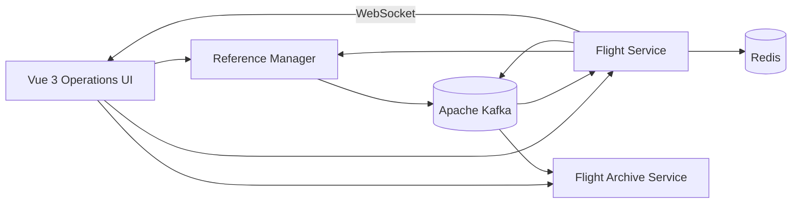

# Flight Management System

> A full-stack airline operations platform built with a microservice-based architecture.

## About the Project

Flight Management System is an airline operations application developed to manage reference data, flight operations, users, historical records, and system monitoring.

The project consists of three Spring Boot microservices and a Vue 3 operations interface. Each service owns its own database and communicates through REST APIs, Kafka events, Redis caching, and WebSocket messages.

The project is still under active development.

## Architecture

## Services

| Service | Responsibility |
| --- | --- |
| `reference-manager` | Manages airlines, airports, aircraft, aircraft types, routes, and flight types |
| `flight-service` | Manages authentication, users, flight operations, validation, versioning, and activity logs |
| `flight_archive_service` | Archives terminal flight records through Kafka events |
| `flight-management-ui` | Provides the airline operations and administration interface |

## Main Features

- Airline, airport, aircraft, route, and flight type management
- Flight creation, update, cancellation, and listing
- CSV-based bulk flight import
- Realistic mock flight generation
- Reference data validation with Redis caching
- Kafka-based event communication and cache invalidation
- JWT authentication and role-based authorization
- Flight version history and activity logging
- Real-time flight updates with WebSocket
- Event-driven flight archive
- Prometheus and Grafana monitoring
- Docker Compose infrastructure
- Automated backend tests

## Technology Stack

**Backend:** Java 17, Spring Boot, Spring Security, Spring Data JPA, MapStruct, Liquibase

**Communication:** REST API, Apache Kafka, Redis, STOMP/WebSocket

**Databases:** MySQL, PostgreSQL

**Frontend:** Vue 3, TypeScript, Vite, Pinia, Axios, Element Plus, Leaflet

**Infrastructure:** Docker, Docker Compose, Prometheus, Grafana

**Testing:** JUnit 5, Mockito, Spring Boot Test, Testcontainers

## Project Status

### Completed

- [x] Core microservice architecture
- [x] Reference data management
- [x] Flight lifecycle operations
- [x] Authentication and authorization
- [x] Kafka, Redis, and WebSocket integrations
- [x] Flight archive service
- [x] Monitoring infrastructure
- [x] Vue operations interface
- [x] Automated backend tests

### Planned

- [ ] Complete timezone-aware flight scheduling
- [ ] Strengthen aircraft schedule conflict validation
- [ ] Add flight status transition rules
- [ ] Add pagination and advanced filtering
- [ ] Expand frontend and end-to-end tests
- [ ] Add CI/CD workflows
- [ ] Prepare production deployment configuration

## Author

Ali Ozan Karaçor
